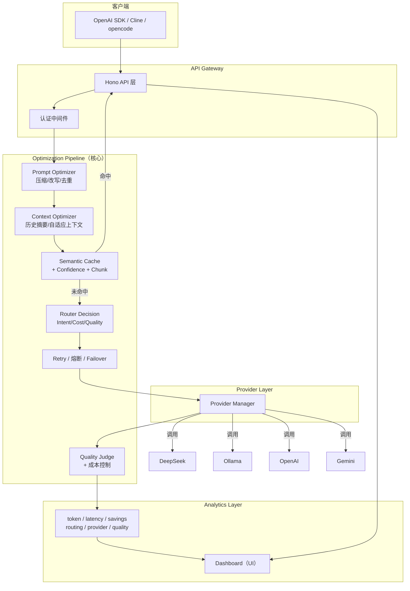
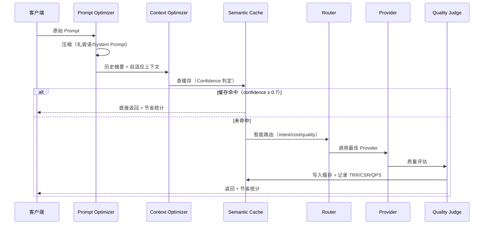

# Nexus

### AI Gateway for Individual Developers

> **Save 30~80% LLM Cost with Zero Configuration.**

一个专门为个人开发者打造的 AI Gateway。任何 AI 应用只需改一个 `baseURL`，Nexus 自动帮你**省 Token + 省成本 + 保持高质量**。

* 🚀 OpenAI Compatible
* 🧠 Smart Auto Routing
* 💰 Token Optimization
* ⚡ Semantic Cache
* 📉 Context Compression
* 🔄 Multi Provider Failover

> **Bring Your Own API Key.**
> **We optimize your cost, not manage your account.**

---

## 🎯 核心指标（North Star Metric）

> Nexus 不围绕"支持多少模型"宣传，而是围绕三个数字：

| 指标 | 全称 | 含义 | 目标 |
|------|------|------|------|
| TRR | Token Reduction Rate | Token 降低率 | **50%+** |
| CSR | Cost Saving Rate | 成本节省率 | **60%+** |
| QPS | Quality Preservation Score | 质量保持率（优化前后对比） | **95%+** |

**每一个新功能上线，都必须回答**：能减少多少 Token？能节省多少钱？回答质量下降了多少？不能提升这三个指标之一，就不进入 Core。

---

## 🧭 产品理念

1. **用户拥有自己的 API（BYOK）**：填自己的 OpenAI / Gemini / DeepSeek / Ollama，Nexus 只负责优化，不是 API 平台。
2. **Gateway 不替用户花钱**：只负责**省钱**。
3. **零配置优先**：默认就是最佳实践，Cache → Compression → Retry → Router → Summary 全部自动开启。
4. **个人优先**：面向个体开发者，无 RBAC / Billing / Organization 负担（Enterprise 单独做）。
5. **所有优化可视化**：每次请求都展示节省了多少 Token / 多少钱。

---

## ✨ 核心能力

| 能力 | 说明 |
|---|---|
| OpenAI 兼容协议 | 任何 OpenAI SDK 改 `baseURL` 即可接入 |
| 多 Provider 适配 | DeepSeek、Ollama（本地）、OpenAI、Gemini、Qwen、Moonshot、Zhipu，统一屏蔽差异 |
| 工程级语义缓存 | Canonical Key + SingleFlight + 分类 TTL + 防毒化 + Cache Confidence（省 Token 核心） |
| Prompt 压缩 | 礼貌语删除、System Prompt 压缩、历史摘要、自适应上下文 |
| 智能路由 | Intent Router + Cost Optimizer + Quality Score，自动选最省最合适的 Provider |
| 故障转移 | 主模型失败自动切备用，熔断器 + 重试指数退避 + 流式/非流式支持 |
| 成本控制 | 预算阈值自动降级（block/cheap_only/warn）、每日成本报告 + 节省来源归因 |
| 质量评估 | Quality Judge + Semantic Judge，优化前后质量对比，Router 自动学习 |
| 管理看板 | 深色模式、Saved% / Saved￥ / Latency / Cache Hit / 当前模型 |
| 可观测性 | 全链路 Trace、TRR/CSR/QPS 指标、优化建议生成 |

---

## 🏗 系统架构（四层）



> 核心不是 Gateway，而是 **Optimization Pipeline**。

---

## 🔄 请求优化流水线



---

## 🧠 缓存引擎（省 Token 核心）

### 工程决策

1. **Canonical Key**：trim + 空白归一 + 首尾语气标点剔除 → `hello！` ≈ `hello`；**中间代码符号保留** → `C++` 不归成 `c`
2. **Admission Policy**：`继续/谢谢/ok` 等短词绝不缓存
3. **SingleFlight**：同 key 并发缺失只放行一个请求打上游（20 并发 → 1 次上游）
4. **Cache Confidence**：每条缓存 0~1 置信度，三档决策（直接返回 / 返回+异步刷新 / 重新生成）
5. **分类 TTL**：价格 30s / 天气 10min / 新闻 30min / 时政 1h / 常识 7 天
6. **防缓存毒化**：空内容 / 含 error / finish_reason=error 一律不缓存；`x-nexus-no-cache: 1` 逃生
7. **Cache Metadata**：响应携带 `nexus.cached / cacheHit / cacheAge`

命中缓存时响应 `nexus` 字段自动附加：
```json
{
  "nexus": {
    "provider": "cache",
    "cached": true,
    "cacheHit": 18,
    "cacheAge": "3h",
    "savedTokens": 410,
    "savedCostMicro": 234
  }
}
```

---

## 🚀 快速开始（BYOK）

> 建议 `source ~/.nvm/nvm.sh && nvm use 22`（Node 22）。

### 1. 环境准备

```bash
cp .env.example .env
# 填写你**自己的** API Key：
# DEEPSEEK_API_KEY=sk-xxx
# GEMINI_API_KEY=xxx（可选）
# OPENAI_API_KEY=（可选）
```

### 2. 启动依赖（Postgres + Redis）

```bash
docker compose up -d postgres redis
```

### 3. 安装依赖 & 迁移 & 种子

```bash
npm install
npx drizzle-kit push --force   # 同步 schema
npm run seed                   # 输出一个 dev API Key，保存它
```

### 4. 启动网关

```bash
npm run dev
```

### 5. 验证

```bash
# 模型列表
curl http://localhost:8787/v1/models -H "Authorization: Bearer <key>"

# 对话（自动优化：压缩 → 缓存 → 路由）
curl http://localhost:8787/v1/chat/completions \
  -H "Authorization: Bearer <key>" -H "Content-Type: application/json" \
  -d '{"model":"auto","messages":[{"role":"user","content":"你好"}]}'

# 再发一次相同问题 → 命中缓存（nexus.cached=true, savedTokens>0）
```

> `model=auto` 让 Nexus 自动选择最省最合适的 Provider。请求头 `x-nexus-no-optimize: 1` 可强制跳过优化。

---

## 📡 使用 OpenAI SDK 接入

```python
from openai import OpenAI
client = OpenAI(base_url="http://localhost:8787/v1", api_key="<你的-key>")
resp = client.chat.completions.create(
    model="auto",  # 或 deepseek-v4-flash 等具体模型
    messages=[{"role":"user","content":"你好"}]
)
```

```javascript
import OpenAI from "openai";
const client = new OpenAI({
  baseURL: "http://localhost:8787/v1",
  apiKey: "<你的-key>",
});
const resp = await client.chat.completions.create({
  model: "auto",
  messages: [{ role: "user", content: "你好" }],
});
```

---

## � 优化可视化 API

| 端点 | 说明 |
|------|------|
| `GET /admin/optimization/stats` | 今日 TRR / CSR / QPS + 节省 Token/金额 |
| `GET /admin/optimization/suggestions` | 优化建议（TrendAnalyzer） |
| `GET /admin/cost/report` | 成本报告（按 provider/model/intent，支持 CSV） |
| `GET /admin/cache/confidence` | 缓存置信度分布 + 热门 Prompt |
| `GET /admin/analytics/report` | 每日统计分析 + 请求画像 |

---

## 🧪 测试 & 基准

```bash
nvm use 22 && npm test
# → 334 个测试全过（44 个测试文件：缓存/容错/路由/压缩/成本/质量/DSL/Agent/Workflow 等）
```

```bash
# 离线 Benchmark
node benchmark/offline-benchmark.mjs
# 性能压测（20 并发 5 秒，可自定义）
CONCURRENT=50 DURATION=10 node benchmark/load-test.mjs
```

---

## 🛠 技术栈

- **运行时**: Node.js 22 / TypeScript
- **Web 框架**: Hono
- **数据库**: PostgreSQL + pgvector（Drizzle ORM）
- **缓存/限流**: Redis
- **看板**: Next.js + Tailwind（深色 Vercel 风格）
- **测试**: Vitest
- **部署**: Docker Compose + Nginx

---

## 📁 项目结构（规划中，v2.0 目录重构）

```
src/
├── providers/        # Provider Layer（只调用 API）
├── optimizer/        # 核心：prompt/context/cache/router/compression/summary/cost/quality（规划）
├── analytics/        # token/latency/cache/provider/routing/savings/quality（规划）
├── server/           # API Gateway + 现有实现的暂存位置
├── dashboard/        # UI：Saved% / Saved￥ / Latency / Cache Hit
├── benchmark/        # 基准测试
├── cli/              # CLI 工具
├── sdk/              # TS + Python SDK
└── scripts/          # 可行性测试
```

---

## 🌐 Provider 代理配置（国内访问 OpenAI / Gemini）

```bash
# 格式：<PROVIDER_TYPE>_PROXY=http://127.0.0.1:<代理端口>
GEMINI_PROXY=http://127.0.0.1:7897    # Clash 代理
# OPENAI_PROXY=http://127.0.0.1:7897  # OpenAI 也走代理
```

> 仅配置了代理的 Provider 走代理，其余直连。Gemini 建议使用 `gemini-flash-lite`（免费额度宽裕）。

---

## � 开发路线

> 完整路线见 [`fit/improve.md`](fit/improve.md)。以 TRR/CSR/QPS 为北极星指标。

- [ ] **v2.0** Project Refactor：目录重构（Provider/Optimizer/Analytics/UI）、移除 Enterprise、BYOK 首次启动向导、Optimization Pipeline
- [ ] **v2.1** Prompt Optimization：Compression / Rewrite / Deduplicate
- [ ] **v2.2** Conversation Optimization：Auto Summary / Adaptive Context / History Compression
- [ ] **v2.3** Semantic Cache 2.0：Confidence / Adaptive TTL / Chunk Cache / Partial Cache
- [ ] **v2.4** Smart Cost Engine：Cost Predictor / Provider Recommendation / Auto Routing
- [ ] **v2.5** Developer Experience：One Click Install / Config Wizard / VSCode Plugin

---

## 📄 License

MIT