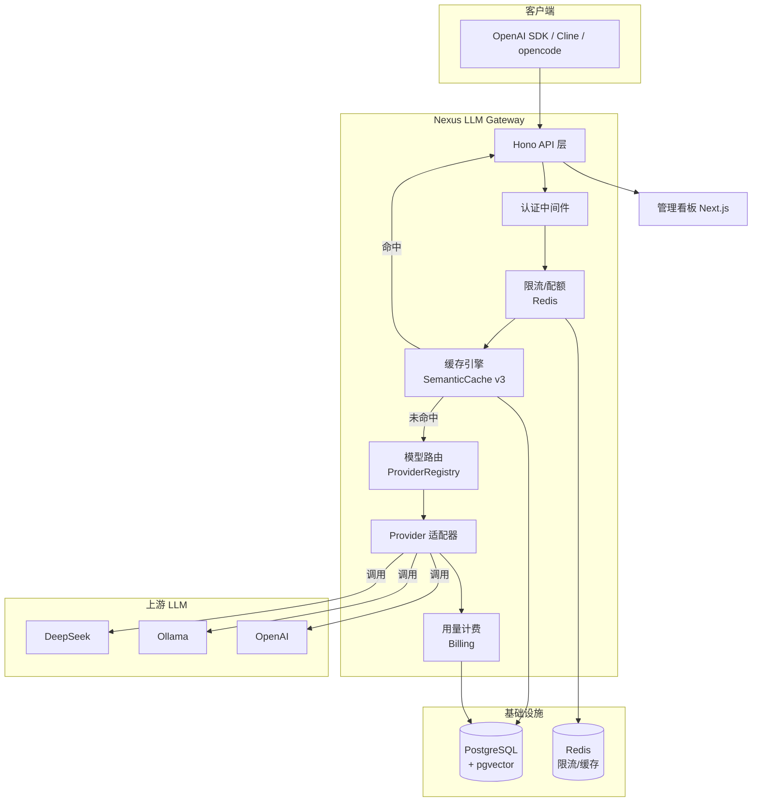
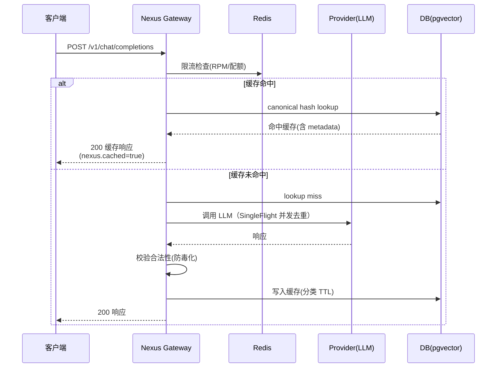
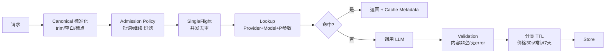

# Nexus LLM Gateway

> 生产级 AI 统一网关 —— OpenAI 兼容协议，多 Provider 适配，工程级缓存、限流配额、故障转移、用量计费、管理看板。

让任何 AI 应用只需改一个 `baseURL`，就能获得**成本治理 + 高可用 + 可观测性**。

## ✨ 核心能力

| 能力 | 说明 |
|---|---|
| OpenAI 兼容协议 | 任何 OpenAI SDK 改 `baseURL` 即可接入 |
| 多 Provider 适配 | DeepSeek、Ollama（本地）、OpenAI，统一屏蔽差异 |
| 工程级缓存 | Canonical Key + 参数分桶 + SingleFlight + 分类 TTL + 防毒化 |
| 模型路由 | 按模型别名路由到对应 Provider |
| 故障转移 | 主模型失败自动切备用，流式/非流式均支持 |
| 限流配额 | Redis 令牌桶 RPM + 月度 Token 配额 |
| 用量计费 | token 计数、按模型计价（`modelRoutes.price`） |
| 多租户 | API Key 隔离、独立配额、增强缓存审批 |
| 管理看板 | 深色模式、趋势图/缓存统计/模型路由/实时日志、双端（管理/用户） |
| 可观测性 | 全链路追踪 ID、Cache Metadata、命中率/节省 token 统计 |
| 测试 | Vitest 单测（21 用例）+ 缓存基准脚本 |

## 🏗 系统架构



## 🔄 请求生命周期



## 🧠 缓存引擎（核心差异化能力）

### 流程



### 设计的工程决策

1. **Canonical Key（Prompt 标准化）**
   - trim + 空白归一 + 首尾语气标点剔除 → `hello！` ≈ `hello`
   - **中间代码符号保留** → `C++` 不会归成 `c`、`1+1` 不会归成 `11`（宁少命中，不命中错误）
2. **Admission Policy（准入策略）**
   - "继续 / 谢谢 / ok" 等上下文短词**绝不缓存**，防止命中旧上下文返回无关内容
3. **SingleFlight（防缓存击穿）**
   - 同 key 并发缺失只放行一个请求打上游，其余共享结果（实测 20 并发 → 1 次上游）
4. **参数分桶（Bucket）**
   - temperature 0.71 与 0.72 → 同一桶，微小差异不破坏命中
5. **Provider + Model 隔离**
   - Cache Key 含 provider|model，不同模型/上游不互相污染
6. **分类 TTL（Cache Policy）**
   - 价格行情 30s / 天气 10min / 新闻 30min / 时政 1h / 常识问候 **7 天**
7. **防缓存毒化**
   - 写入前校验：空内容 / 含 error / `finish_reason=error` 一律不缓存
   - 逃生通道：请求头 `x-nexus-no-cache: 1` 强制绕过缓存
8. **Cache Metadata（可观测性）**
   - 命中响应携带 `nexus.cacheId / cacheHit / cacheAge` 调试体验极佳

### 响应中的缓存元数据

命中缓存时，响应 `nexus` 字段自动附加：

```json
{
  "id": "chatcmpl-xxx",
  "choices": [{ "message": { "role": "assistant", "content": "..." } }],
  "nexus": {
    "provider": "cache",
    "cached": true,
    "cacheId": "abdc...-uuid",
    "cacheHit": 18,
    "cacheAge": "3h",
    "requestId": "req_xxx"
  }
}
```

### 查看缓存统计

```bash
curl http://localhost:8787/admin/cache/stats -H "Authorization: Bearer <master-key>"
# → {"cache":{"totalEntries":N,"totalHits":M,"avgHits":x,"totalSavedTokens":K}}
```

## 🛠 技术栈

- **运行时**: Node.js 20+ / TypeScript
- **Web 框架**: Hono
- **数据库**: PostgreSQL + pgvector（Drizzle ORM）
- **缓存/限流**: Redis
- **看板**: Next.js + Tailwind + Recharts + Lucide（深色 Vercel 风格）
- **测试**: Vitest
- **部署**: Docker Compose + Nginx

## 🚀 快速开始

> 建议 `source ~/.nvm/nvm.sh && nvm use 22`（Node 20+）。也可以直接用提交的 `./start.sh` 一键启动全部（Docker+DB+网关+看板）。

### 1. 环境准备

```bash
cp .env.example .env
# 编辑 .env，填入 DEEPSEEK_API_KEY 等
```

### 2. 启动依赖（Postgres + Redis）

```bash
docker compose up -d postgres redis
```

### 3. 安装依赖 & 迁移 & 种子

```bash
npm install
npx drizzle-kit push --force   # 同步 schema
npm run seed                   # 输出一个 dev API Key，保存它（注：seed 现在会打码，真实凭据从看板/管理端创建）
```

### 4. 启动网关

```bash
npm run dev
```

### 5. 启动看板（可选）

```bash
cd dashboard && npm install && npm run dev
# 打开 http://localhost:3000，用 Master Key 登录管理端，API Key 登录用户端
```

### 6. 验证

```bash
# 模型列表
curl http://localhost:8787/v1/models -H "Authorization: Bearer <key>"

# 对话（第一次 miss→调 LLM）
curl http://localhost:8787/v1/chat/completions \
  -H "Authorization: Bearer <key>" -H "Content-Type: application/json" \
  -d '{"model":"deepseek-v4-flash","messages":[{"role":"user","content":"你好"}]}'

# 再发一次相同问题 → 命中缓存（nexus.cached=true, 0 token）
```

## 🧪 测试 & 基准

### 单元测试

```bash
nvm use 22 && npm test
# → 67 个测试全过（canonical/准入/hash 隔离/分桶/分类TTL/SingleFlight/Provider Mock/Registry/Utils）
```

### 离线 Benchmark

```bash
node benchmark/offline-benchmark.mjs
```

### 在线基准测试（需网关运行 + 有效 Key）

```bash
source ~/.nvm/nvm.sh && nvm use 22
node benchmark/cache-benchmark.mjs
```

实测输出（含示例）：
```
[1] 重复查询 → 后续 4/4 命中，缓存延迟 0ms
[2] hello/hello！/hello?/"hello " → 全部命中（canonical 生效）
[4] 20 并发同 prompt → 上游调用 1 次（SingleFlight 生效）
[5] 继续/谢谢/ok → 均不缓存（防误命中）
```

### 性能压测

```bash
# 默认 20 并发，持续 5 秒
node benchmark/load-test.mjs

# 自定义参数
CONCURRENT=50 DURATION=10 GATEWAY_MODEL=gemini-flash-lite node benchmark/load-test.mjs
```

### CI 每日 Benchmark

<!-- BENCHMARK_START -->
<!-- BENCHMARK_END -->

## 📡 使用 OpenAI SDK 接入

```python
from openai import OpenAI
client = OpenAI(base_url="http://localhost:8787/v1", api_key="<你的-key>")
resp = client.chat.completions.create(
    model="deepseek-v4-flash",
    messages=[{"role":"user","content":"你好"}]
)
print(resp.choices[0].message.content)
```

```javascript
import OpenAI from "openai";
const client = new OpenAI({
  baseURL: "http://localhost:8787/v1",
  apiKey: "<你的-key>",
});
const resp = await client.chat.completions.create({
  model: "deepseek-v4-flash",
  messages: [{ role: "user", content: "你好" }],
});
```

## 📁 项目结构

```
src/
├── shared/          # 共享类型、配置、日志、工具
├── server/
│   ├── db/          # Drizzle schema、client、redis、seed
│   ├── cache/       # 缓存引擎 semantic-cache（+ 单测）
│   ├── providers/   # Provider 适配器 + 注册中心
│   ├── middleware/  # 认证、日志
│   ├── routes/      # chat / embeddings / models / admin / user / health
│   ├── billing/     # 用量记录与计费
│   ├── quota/       # Redis 限流与配额
│   └── index.ts     # 入口
├── dashboard/       # Next.js 管理看板（管理端 + 用户端）
├── benchmark/       # 缓存基准测试
├── deploy/          # Nginx 配置示例
└── vitest.config.ts # 单测配置
```

## 🌐 Provider 代理配置（国内访问 OpenAI / Gemini 等）

国内网络无法直连 Google Gemini、OpenAI 等海外 API。网关支持**按 Provider 独立配置 HTTP 代理**，仅需要代理的 Provider 走代理，DeepSeek / Ollama 等国内/本地 Provider 保持直连不受影响。

### 配置方法

在 `.env` 中添加：

```bash
# 格式：<PROVIDER_TYPE>_PROXY=http://127.0.0.1:<代理端口>
# 仅配置了代理的 Provider 会走代理，其余直连
GEMINI_PROXY=http://127.0.0.1:7897    # Clash 代理
# OPENAI_PROXY=http://127.0.0.1:7897  # OpenAI 也走代理
```

### 支持的代理类型

- **Clash / Clash Verge**：默认端口 7897（mixed）或 7890
- **V2Ray**：HTTP 代理端口
- **任何 HTTP/HTTPS 代理**：`http://host:port`

### 工作原理

```
客户端 → 网关(8787) → [有 PROXY 配置的 Provider] → 代理(7897) → 海外 API
                     → [无 PROXY 配置的 Provider] → 直连 → 国内 API
```

网关内部使用 `undici.ProxyAgent`（与 `undici.fetch` 同源），避免 Node 全局 `fetch` 与 `ProxyAgent` 的类型不兼容问题。

### 实测验证

```bash
# .env 配置 GEMINI_PROXY=http://127.0.0.1:7897 后重启网关
curl http://localhost:8787/v1/chat/completions \
  -H "Authorization: Bearer <key>" \
  -d '{"model":"gemini-flash-lite","messages":[{"role":"user","content":"hi"}]}'
# → {"provider":"gemini","content":"Hi there!"}
```

### 注意事项

- **Gemini 模型选择**：`gemini-2.0-flash` 免费层限额为 0（对新用户不开放），建议使用 `gemini-flash-lite`（对应 `gemini-flash-lite-latest`，免费额度宽裕）
- **共享代理 IP 限流**：如果使用共享机场节点，Google 可能对该 IP 全局限流（429），建议切换到独享/原生节点
- **OpenAI 同理**：国内直连 `api.openai.com` 超时，配置 `OPENAI_PROXY` 即可通过代理调用

## 🛡 限流与配额

- **RPM 限流**：Redis 令牌桶，按 API Key 限制每分钟请求数（默认 60），超限返回 `429`
- **月度配额**：按租户限制当月 Token 总量，超限返回 `429`
- 响应头 `X-RateLimit-Remaining` 返回当前窗口剩余请求数

## 🚢 部署指南

### 一键部署（Docker Compose）

```bash
cp .env.production.example .env.production
# 编辑 .env.production，填入真实密钥和 API Key
chmod +x deploy.sh && ./deploy.sh
```

### Nginx 反向代理 + SSL

```bash
sudo apt install nginx certbot python3-certbot-nginx
sudo certbot --nginx -d gateway.yourdomain.com
sudo cp deploy/nginx.conf.example /etc/nginx/sites-available/nexus-gateway
sudo ln -s /etc/nginx/sites-available/nexus-gateway /etc/nginx/sites-enabled/
sudo nginx -t && sudo systemctl reload nginx
```

### 生产部署架构

```
用户 → CDN → Nginx(SSL) → Nexus Gateway → DeepSeek/Ollama/OpenAI
                                ↓
                        Postgres + Redis
```

**最低配置**：1 核 1G（个人测试）/ 推荐 2 核 4G+（团队生产）

## 🗓 开发路线

- [x] **Week 1**: 核心网关 MVP（Provider 适配、OpenAI 兼容路由、认证、用量记录）
- [x] **Week 2**: 缓存引擎、限流配额、故障转移、全链路日志
- [x] **Week 3**: 深色管理看板（管理端+用户端）、Docker 化、部署
- [x] **Week 3.5**: 工程级缓存 v3（Canonical/SingleFlight/分类TTL/防毒化）+ 单测 + 基准
- [ ] **Week 4**: 多 Provider 高级 failover、熔断器、Retry 指数退避、Prometheus 监控

## 📄 License

MIT