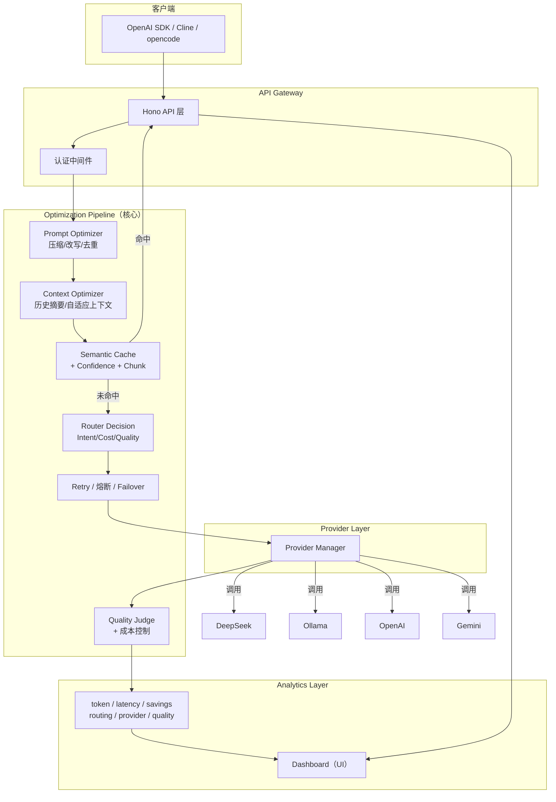
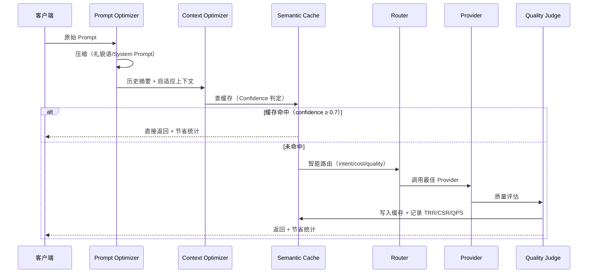

# Nexus

### AI Cost Optimization Gateway

[](https://github.com/bran-huang/nexus-llm-gateway/actions)
[](#)
[](https://github.com/bran-huang/nexus-llm-gateway/releases)
[](./LICENSE)

> **Use fewer tokens. Save 30-80% LLM cost. Zero configuration.**

[GitHub](https://github.com/bran-huang/nexus-llm-gateway) · [Releases](https://github.com/bran-huang/nexus-llm-gateway/releases) · [CHANGELOG](./CHANGELOG.md) · [Contributing](./CONTRIBUTING.md)

---

### Why Nexus?

Most gateways optimize routing. Nexus focuses on something simpler: **USE FEWER TOKENS**.

```
Request → Cache → Dedup → Compression → Smart Routing → Explainable Savings
```

Any OpenAI-compatible app changes one `baseURL` → Nexus automatically reduces tokens, lowers cost, maintains quality. BYOK (Bring Your Own Key).

---

## Project Status

**Actively developed.** Current focus:

- Token optimization for individual developers (BYOK)
- Multi-provider smart routing (DeepSeek, Gemini, OpenAI, Ollama, Qwen, Moonshot, Zhipu)
- Explainable savings (per-request attribution)
- Privacy-first tenant isolation + encrypted provider keys

| Metric | Value |
|--------|-------|
| CI | Passing |
| Automated tests | 395+ (53 files) |
| Deployment | Render (public) |
| Releases | [v2.2.0](https://github.com/bran-huang/nexus-llm-gateway/releases) |

---

## 🎯 核心指标（North Star Metric）

> Nexus 不围绕"支持多少模型"宣传，而是围绕三个数字：

| 指标 | 全称 | 含义 | 目标 |
|------|------|------|------|
| TRR | Token Reduction Rate | Token 降低率 | **50%+** |
| CSR | Cost Saving Rate | 成本节省率 | **60%+** |
| QPS | Quality Preservation Score | 质量保持率（优化前后对比） | **95%+** |

**每一个新功能上线，都必须回答**：能减少多少 Token？能节省多少钱？回答质量下降了多少？不能提升这三个指标之一，就不进入 Core。

---

## 🧭 产品理念

1. **用户拥有自己的 API（BYOK）**：填自己的 OpenAI / Gemini / DeepSeek / Ollama，Nexus 只负责优化，不是 API 平台。
2. **Gateway 不替用户花钱**：只负责**省钱**。
3. **零配置优先**：默认就是最佳实践，Cache → Compression → Retry → Router → Summary 全部自动开启。
4. **个人优先**：面向个体开发者，无 RBAC / Billing / Organization 负担（Enterprise 单独做）。
5. **所有优化可视化**：每次请求都展示节省了多少 Token / 多少钱。

---

## ✨ 核心能力

| 能力 | 说明 |
|---|---|
| OpenAI 兼容协议 | 任何 OpenAI SDK 改 `baseURL` 即可接入 |
| 多 Provider 适配 | DeepSeek、Ollama（本地）、OpenAI、Gemini、Qwen、Moonshot、Zhipu，统一屏蔽差异 |
| 工程级语义缓存 | Canonical Key + SingleFlight + 分类 TTL + 防毒化 + Cache Confidence（省 Token 核心） |
| Prompt 压缩 | 礼貌语删除、System Prompt 压缩、历史摘要、自适应上下文 |
| 智能路由 | Intent Router + Cost Optimizer + Quality Score，自动选最省最合适的 Provider |
| 故障转移 | 主模型失败自动切备用，熔断器 + 重试指数退避 + 流式/非流式支持 |
| 成本控制 | 预算阈值自动降级（block/cheap_only/warn）、每日成本报告 + 节省来源归因 |
| 质量评估 | Quality Judge + Semantic Judge，优化前后质量对比，Router 自动学习 |
| 管理看板 | 深色模式、Saved% / Saved￥ / Latency / Cache Hit / 当前模型 |
| 可观测性 | 全链路 Trace、TRR/CSR/QPS 指标、优化建议生成 |

---

## 🏗 系统架构（四层）



> 核心不是 Gateway，而是 **Optimization Pipeline**。

---

## 🔄 请求优化流水线



---

## 🧠 缓存引擎（省 Token 核心）

### 工程决策

1. **Canonical Key**：trim + 空白归一 + 首尾语气标点剔除 → `hello！` ≈ `hello`；**中间代码符号保留** → `C++` 不归成 `c`
2. **Admission Policy**：`继续/谢谢/ok` 等短词绝不缓存
3. **SingleFlight**：同 key 并发缺失只放行一个请求打上游（20 并发 → 1 次上游）
4. **Cache Confidence**：每条缓存 0~1 置信度，三档决策（直接返回 / 返回+异步刷新 / 重新生成）
5. **分类 TTL**：价格 30s / 天气 10min / 新闻 30min / 时政 1h / 常识 7 天
6. **防缓存毒化**：空内容 / 含 error / finish_reason=error 一律不缓存；`x-nexus-no-cache: 1` 逃生
7. **Cache Metadata**：响应携带 `nexus.cached / cacheHit / cacheAge`

命中缓存时响应 `nexus` 字段自动附加：
```json
{
  "nexus": {
    "provider": "cache",
    "cached": true,
    "cacheHit": 18,
    "cacheAge": "3h",
    "savedTokens": 410,
    "savedCostMicro": 234
  }
}
```

---

## 🚀 快速开始（BYOK）

> 建议 `source ~/.nvm/nvm.sh && nvm use 22`（Node 22）。

### 1. 环境准备

```bash
cp .env.example .env
# 填写你**自己的** API Key：
# DEEPSEEK_API_KEY=sk-xxx
# GEMINI_API_KEY=xxx（可选）
# OPENAI_API_KEY=（可选）
```

### 2. 启动依赖（Postgres + Redis）

```bash
docker compose up -d postgres redis
```

### 3. 安装依赖 & 迁移 & 种子

```bash
npm install
npx drizzle-kit push --force   # 同步 schema
npm run seed                   # 输出一个 dev API Key，保存它
```

### 4. 启动网关

**开发模式**（热重载）：
```bash
npm run dev
```

**生产模式**（构建后运行）：
```bash
npm run build                           # tsc → dist/
node --env-file=.env dist/server/index.js
```

> 构建产物在 `dist/` 目录，入口 `dist/server/index.js`。`npm run build` 后无需 `tsx`/`src/`。

### 5. 验证

```bash
# 模型列表
curl http://localhost:8787/v1/models -H "Authorization: Bearer <key>"

# 对话（自动优化：压缩 → 缓存 → 路由）
curl http://localhost:8787/v1/chat/completions \
  -H "Authorization: Bearer <key>" -H "Content-Type: application/json" \
  -d '{"model":"auto","messages":[{"role":"user","content":"你好"}]}'

# 再发一次相同问题 → 命中缓存（nexus.cached=true, savedTokens>0）
```

> `model=auto` 让 Nexus 自动选择最省最合适的 Provider（简单任务省钱，复杂任务自动升级强模型）。请求头 `x-nexus-no-optimize: 1` 可强制跳过优化。
>
> **手动切换档位（最低门槛，只改一个字符串）**：
> - `model=auto-cheap`（或 `auto:cheap`）→ 强制最便宜模型
> - `model=auto-strong`（或 `auto:strong`）→ 强制强模型（复杂任务/Agent 用）
> - 高级：请求头 `x-nexus-model-tier: cheap | balanced | strong` 同样生效

---

## 🌐 开放注册（BYOK 模式）

Nexus 支持开放注册，允许他人自建账号并使用**自己的** Provider API Key：

```bash
# 1. 开启注册（默认关闭）
REGISTRATION_ENABLED=true

# 2. 用户通过看板注册或直接调用 API
curl -X POST http://localhost:8787/auth/register \
  -H "Content-Type: application/json" \
  -d '{"username":"alice","password":"mypassword123"}'
# → 返回 API Key（仅显示一次，请立即保存）

# 3. 用户用 API Key 登录看板，在「我的 Provider」配置自己的 Key
# 4. 调用 API（租户专用 Provider Key 优先 → 回退全局 → 回退 .env）
```

> ⚠️ **BYOK 模式核心原则**：注册用户自带 Provider API Key，成本完全自理。Nexus **不提供任何免费额度**。未配置 Provider Key 时调用会返回明确错误提示。

## 👤 用户端功能

注册用户登录后可使用（全部按租户隔离，仅自己的数据）：

- **概览**：今日/本月请求、Token、缓存命中率、节省 Token（按来源拆分）
- **请求记录**：最近请求列表（cursor 分页）+ 点击查看**请求详情**（原始/优化 Token、节省来源 CACHE/COMPRESSION/ROUTING、成本、延迟）
- **测速**：用自己的 Provider Key 测试各模型延迟（并发/冷却防滥用，不消耗 master 额度）
- **我的 Key**：Gateway Key 列表 + 启停（停用后立即 401）
- **我的 Provider**：配置自己的 Provider API Key（AES-256-GCM 加密，仅显示脱敏值）
- **用量导出**：CSV 下载
- **优化档位**：fast / balanced / cheap / maximum_saving（真正影响压缩与路由）
- **隐私与安全**：数据边界说明（元数据存储、无 prompt/response 历史、tenant 隔离）

> 闲置租户（默认 30 天无活跃）数据自动清理（`IDLE_TENANT_CLEANUP_DAYS`）。

---

## 📡 使用 OpenAI SDK 接入

```python
from openai import OpenAI
client = OpenAI(base_url="http://localhost:8787/v1", api_key="<你的-key>")
resp = client.chat.completions.create(
    model="auto",  # 或 deepseek-v4-flash 等具体模型
    messages=[{"role":"user","content":"你好"}]
)
```

```javascript
import OpenAI from "openai";
const client = new OpenAI({
  baseURL: "http://localhost:8787/v1",
  apiKey: "<你的-key>",
});
const resp = await client.chat.completions.create({
  model: "auto",
  messages: [{ role: "user", content: "你好" }],
});
```

---

## � 优化可视化 API

| 端点 | 说明 |
|------|------|
| `GET /admin/optimization/stats` | 今日 TRR / CSR / QPS + 节省 Token/金额 |
| `GET /admin/optimization/suggestions` | 优化建议（TrendAnalyzer） |
| `GET /admin/cost/report` | 成本报告（按 provider/model/intent，支持 CSV） |
| `GET /admin/cache/confidence` | 缓存置信度分布 + 热门 Prompt |
| `GET /admin/analytics/report` | 每日统计分析 + 请求画像 |

---

## 🔒 隐私与安全（Privacy by Architecture）

> 不是"作者承诺不偷看"，而是**架构默认不允许**获取你的 Prompt / Response / API Key。

- **Provider API Key 静态加密**：AES-256-GCM（`enc:v1:...`），密钥 `ENCRYPTION_KEY`；API 只返回脱敏值 `sk-****abcd`。
- **Gateway Key 只存哈希**：SHA-256，创建时仅展示一次。
- **日志全局脱敏**：`apiKey / authorization / password / secret` 一律输出 `[REDACTED]`。
- **无远程遥测**：不向任何外部端点发送 Prompt / Response / 指标；`observability.ts` 仅本地日志。
- 详细说明见 [SECURITY.md](./SECURITY.md) 与 [PRIVACY.md](./PRIVACY.md)。

## ☁️ 云端部署（Render）

仓库含 `render.yaml`，Render 上 **New → Blueprint → 选择仓库** 一键部署（Web Service + PostgreSQL + Redis + 健康检查 + 自动迁移）。

```bash
# 本地部署（Docker 起依赖）:
docker compose up -d && npm ci && npx drizzle-kit push && npm run dev
```

完整指南见 [DEPLOYMENT.md](./DEPLOYMENT.md)（本地 / Render 两种模式、环境变量清单、验证命令）。

## 🧪 测试 & 基准

```bash
nvm use 22 && npm test
# → 401 个测试全过（54 个测试文件：缓存/容错/路由/压缩/成本/质量/DSL/Agent/Workflow/注册/归因 等）
```

```bash
# 离线 Benchmark
node benchmark/offline-benchmark.mjs
# 性能压测（20 并发 5 秒，可自定义）
CONCURRENT=50 DURATION=10 node benchmark/load-test.mjs
```

---

## 🛠 技术栈

- **运行时**: Node.js 22 / TypeScript
- **Web 框架**: Hono
- **数据库**: PostgreSQL + pgvector（Drizzle ORM）
- **缓存/限流**: Redis
- **看板**: Next.js + Tailwind（深色 Vercel 风格）
- **测试**: Vitest
- **部署**: Docker Compose + Nginx

---

## 📁 项目结构（v2.0）

```
src/
├── providers/        # Provider Layer：registry / base / deepseek / ollama / openai
├── optimizer/        # Optimization Pipeline（核心）
│   ├── prompt/       # compression / conversation-compressor / adaptive-context / router / intent-learning
│   ├── cache/        # semantic-cache / cache-gate / cache-confidence / cache-auto-refresh / embedding-screener
│   ├── routing/      # smart-routing
│   ├── cost/         # cost-controller / optimization-profile
│   └── judge/        # request-judge / judge
├── analytics/        # daily-stats / trend-analyzer / e2e-metrics
├── server/           # API Gateway：routes / middleware / db
├── extensions/       # 拓展区（暂缓模块）：dsl / workflow / agent / scheduler / plugins
├── dashboard/        # Next.js 运营分析面板：TRR/CSR/QPS 指标 / 成本趋势 / 模型排行 / 优化建议
├── benchmark/        # 基准测试
├── cli/              # CLI 工具
├── sdk/              # TS + Python SDK
└── scripts/          # 可行性测试
```

---
## 🛤 开发路线

> 完整路线见 [`fit/improve.md`](fit/improve.md)。以 TRR/CSR/QPS 为北极星指标。

- [x] **v2.0** ✅ 目录重构 + Optimization Pipeline 全链路接线 + Dashboard 价值化（Hero「Today You Saved」）
- [x] **v2.1** ✅ 生产审计修复（P0-P2：流式崩溃/超时/计价/SSRF/硬编码 key）
- [x] **v2.2** ✅ 巡检修复 + Release v2.2.0 + 凭据加密 + 安全/隐私/部署文档 + render.yaml
- [x] **v2.3** ✅ 开放注册（BYOK）+ 用户端体验（测速/请求记录/导出/Key 管理）+ **Savings Engine**（统一归因，防 double counting）+ Profile 产品化 + Privacy Center + 闲置清理（401 tests）
- [ ] **v2.4** Optimization Overhead 计量 / 月度预测（PROJECTED）/ 生态集成（LangChain 等）

---

## 📄 License

MIT