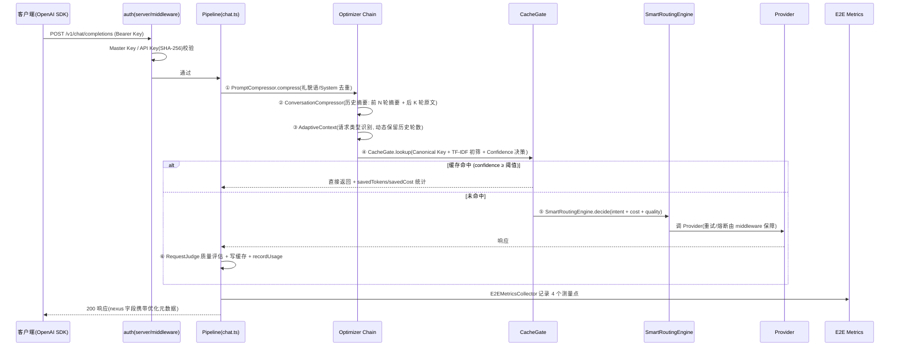
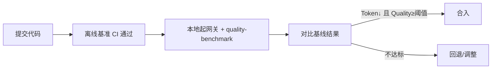

# Nexus 产品开发规格说明书(SSOT)

> **版本**: v1.0(2026)
> **状态**: 正式生效
> **定位**: 本文件是 Nexus 项目**唯一架构级真相源(Single Source of Truth)**。所有未来 AI agent 与开发者,在开始任何开发任务前必须先读本文件,再读 `fit/improve.md`(任务状态)与 `docs/adr/`(决策记录)。
> **范围**: 架构、优化引擎、开发原则、RFC 流程、Benchmark、Roadmap、Definition of Done、Agent 开发规则。
> **不覆盖**: 任务执行状态与已完成清单(`fit/improve.md`)、具体技术决策(`docs/adr/`)、快速开始(`docs/quickstart.md`)。

---

# Chapter 1: Vision

## 1.1 使命

Nexus 是一个 **AI Native LLM Gateway**,但它的唯一使命是:

> **自动优化每一次 LLM 请求。**

Nexus 不追求"支持最多 Provider"(LiteLLM 的赛道),不追求"API 管理平台"(OneAPI 的赛道),不追求"模型市场"(OpenRouter 的赛道)。Nexus 的赛道是 **Optimization**:同一请求,经 Nexus 转发后,Token 更少、成本更低、延迟更低,而回答质量不降。

## 1.2 核心价值(四条)

| 价值 | 含义 | 北极星关联 |
|---|---|---|
| 降低 Token 消耗 | 压缩 prompt、摘要历史、缓存复用 | TRR |
| 降低成本 | 智能路由到最便宜且够用的模型 | CSR |
| 降低延迟 | 缓存直返、并发优化、流式优先 | Latency |
| 保持质量 | 优化前后质量可量化、可回退 | QPS |

**业务哲学**: BYOK(Bring Your Own Keys)。用户配置自己的 API Key,Nexus 不卖模型、不代付账单,只做优化。Nexus 优化的是"用户自己的钱"。

## 1.3 目标用户

- 个人开发者(Individual Developers)
- AI 工程师 / AI 应用开发者
- Indie Hackers
- 小团队

**明确不做**: 企业级多租户管理、RBAC 治理、Billing 结算、SSO 集成。这些归 `src/extensions/`,不进 Core(见 Principle 2)。

## 1.3.1 产品形态(2026-08 决策): 个人单租户

- **现状**: master 管理端 + API Key 用户端双视图(dashboard 双套组件、page.tsx 按角色分流),为历史继承的多租户形态。
- **目标形态**: **个人单租户工作台**。master 端即个人控制台,集成自己的 Key 管理、用量、成本、优化报告、路由配置;API Key 仅作为**接入凭证**(服务自己的应用),不再有"租户/多用户"概念。
- **租户端隔离**: 多租户(用户端 dashboard、租户管理、API Keys 管理页)隔离进**未来方向**,不进入当前主线;代码保留(tenants/apiKeys 表与 user 路由不动),不做新功能。
- **执行任务**: 见 `fit/improve.md` R5。

## 1.4 产品原则(最高优先级,违反即 reject)

- **P1 指标门槛**: 每个功能必须至少改善一个指标(Token / Cost / Latency / Quality),否则拒绝。
- **P2 企业隔离**: 企业功能绝不进入 Core,物理隔离在 `src/extensions/`。
- **P3 引擎唯一核心**: Optimization Engine 是唯一核心,其余一切是插件/外围。
- **P4 优化可度量**: 没有 Benchmark 就没有优化。任何优化必须能量化前后差异。
- **P5 架构整洁**: 无巨型类、无功能耦合、核心路径依赖方向单向(server/routes → optimizer → providers)。

## 1.5 北极星指标(North Star)

| 指标 | 全称 | 定义 | 目标 |
|---|---|---|---|
| TRR | Token Reduction Rate | 节省 Token / 原始 Token | ≥ 50% |
| CSR | Cost Saving Rate | 节省金额 / 原始金额 | ≥ 60%(README 口径;fit/improve.md 定义表为 ≥40%,本文档统一取 ≥60%) |
| QPS | Quality Preservation Score | 优化后质量 / 原始质量 | ≥ 95% |
| Latency P50 | 请求耗时中位数 | 含缓存命中与未命中 | 缓存命中 < 100ms |

**指标纪律**:
1. 每个新功能上线必须回答:TRR / CSR / QPS 各自变化多少。
2. 过程指标(如 Cache Hit Rate、Compression Ratio)只作诊断,不作北极星——命中率高不等于省钱。
3. 指标数据来源: `src/analytics/e2e-metrics.ts`(全链路 4 测量点)+ `src/analytics/daily-stats.ts`(日聚合)。

## 1.6 竞争分析

| 竞品 | 赛道 | Nexus 差异 |
|---|---|---|
| LiteLLM | Provider Aggregation(100+ Provider) | 不追 Provider 数量,只优化请求 |
| OneAPI | API Management / 计费 | 不做计费与多租户 |
| OpenRouter | Model Marketplace | 不卖模型、不代付 |
| Cherry Studio | Client | 不做客户端 |

**一句话定位**: "当别人比较支持多少 Provider 时,Nexus 比较平均每次请求为用户省了多少钱。"

## 1.7 Why Nexus Exists

个人开发者的真实成本结构: 90% 的 LLM 开销来自重复的 prompt、冗余的对话历史、过度的模型规格。Nexus 通过自动优化,让同样的应用在同样质量下少花 30%~80% 的钱。**零配置默认即最佳实践**——接入只需改一个 `baseURL`。

---

# Chapter 2: Architecture

## 2.1 总体架构(v2.0 目录结构,已落地)

```text
src/
├── shared/                 # 共享层: config / logger / types / utils
├── providers/              # Provider Layer: registry / base / deepseek / ollama / openai / mock
├── optimizer/              # 核心 Optimization Pipeline(唯一主方向)
│   ├── prompt/             # compression / conversation-compressor / adaptive-context / router
│   ├── cache/              # semantic-cache / cache-gate / cache-confidence / cache-auto-refresh
│   ├── routing/            # smart-routing
│   ├── cost/               # cost-controller
│   └── judge/              # request-judge / judge
├── analytics/              # analytics / daily-stats / trend-analyzer / e2e-metrics / token-analyzer
├── server/                 # API Gateway 层(只留网关职责)
│   ├── routes/             # chat / models / embeddings / health / admin / user / batch
│   ├── middleware/         # auth / logging / metrics / pipeline / circuit-breaker / retry
│   └── db/ quota/ billing/ config/
└── extensions/             # 拓展区(已实现未接线 / 企业向 / 实验),物理隔离
```

**依赖方向(单向,禁止反向)**:
```text
server/routes → optimizer/* → providers/*
            ↘  analytics/*  ↙
server/routes → extensions/  ← 禁止: optimizer 或 routes 之外的模块依赖 extensions
```

**接线事实(2026-08 实测)**: `src/server/routes/chat.ts` 是唯一请求入口,真实接线 10 个核心优化模块。依赖本文件任何"已接入"声明前,用 `grep -rn "模块名" src --include="*.ts" | grep -v test` 验证。

## 2.2 请求生命周期(实现级)



## 2.3 响应生命周期

- 流式: `chat.ts` 用 TransformStream 自实现(cacheToSSE / handleStream)逐块转发并回传 `usage`;`extensions/middleware/streaming-buffer.ts` 已实现未接线。
- 非流式: 完整响应经 Quality 校验后返回。
- 缓存命中响应: 附加 `nexus.cached=true / cacheHit / cacheAge / savedTokens / savedCostMicro`。

## 2.4 核心模块责任(真实文件)

| 模块 | 路径 | 责任 | 接线状态 |
|---|---|---|---|
| Prompt Compressor | `src/optimizer/prompt/compression.ts` | 礼貌语删除、System Prompt 去重 | ✅ 已接线(chat.ts) |
| Conversation Compressor | `src/optimizer/prompt/conversation-compressor.ts` | 历史摘要 + 重要性剪枝 | ✅ 已接线 |
| Adaptive Context | `src/optimizer/prompt/adaptive-context.ts` | 请求类型识别,动态历史轮数 | ✅ 已接线 |
| Cache Gate | `src/optimizer/cache/cache-gate.ts` | 缓存三态决策(直返/刷新/重生成) | ✅ 已接线 |
| Semantic Cache | `src/optimizer/cache/semantic-cache.ts` | Canonical Key + SingleFlight + 分类 TTL | ✅ 已接线 |
| Smart Routing | `src/optimizer/routing/smart-routing.ts` | intent/cost/quality 多维路由 | ✅ 已接线 |
| Budget Controller | `src/optimizer/cost/cost-controller.ts` | 预算检查与降级(block/cheap_only/warn) | ✅ 已接线 |
| Request Judge | `src/optimizer/judge/request-judge.ts` | 质量评分持久化,Router 学习 | ✅ 已接线 |
| E2E Metrics | `src/analytics/e2e-metrics.ts` | TRR/CSR/QPS 全链路测量 | ✅ 已接线 |
| Prompt Router | `src/optimizer/prompt/router.ts` | 模型选择与 fallback | ✅ 已接线(chat.ts:13) |
| Cache Auto Refresh | `src/optimizer/cache/cache-auto-refresh.ts` | 低置信缓存异步刷新 / 热门预生成 | ✅ 已接线(chat.ts:18) |
| Token Analyzer | `src/analytics/token-analyzer.ts` | 逐段 Token 构成分析(R2) | ⚠️ 未接线(仅被测试引用) |
| Chunk Cache | `src/extensions/prompt/chunk-cache.ts` | Chunk 级缓存 | ⚠️ 未接线 |
| Quality Evaluator | `src/extensions/judge/quality-evaluator.ts` | 语义保持评估(chat.ts:23 已 import,非关键路径,异常吞掉) | ✅ 已接线 |
| Cost Optimizer | `src/extensions/prompt/cost-optimizer.ts` | 请求前成本预估(chat.ts:21 已 import,预算链路) | ✅ 已接线 |

> **接线状态为准绳**: 上表"未接线"模块一律不允许被 `server/routes/*` 与 `optimizer/*` 新增 import;对 `extensions/` 的 import 仅允许已接线白名单(`extensions/prompt/cost-optimizer` / `extensions/judge/quality-evaluator`),新增必须走「重新激活流程」(评估 TRR/CSR/QPS 收益 → 接入 Pipeline → 更新本表)。

## 2.5 Optimization Engine(核心,Principle 3)

当前形态: `SmartRoutingEngine`(`src/optimizer/routing/smart-routing.ts`)作为路由决策中枢,整合:
- `IntentLearner`(`src/optimizer/prompt/intent-learning.ts`): 朴素贝叶斯意图分类
- `CostEstimator`(`src/optimizer/cost/cost-controller.ts`): 9 Provider 价格表预估
- `MultiDimRouter`(`src/optimizer/prompt/multi-dim-router.ts`): 质量评分加权

**演进方向(v3)**: 从"路由中枢"演进为"全链路决策引擎",接管压缩强度、摘要轮数、缓存策略、路由目标、质量门槛的**统一决策**,并输出决策理由供 `analytics` 与 Dashboard 展示。每次演进必须满足 Principle 4(Benchmark 可量化)。

## 2.6 Plugin System(插件化边界)

- **已实现**: `src/extensions/plugins/plugin-system.ts`(事件总线式插件,未接线)。
- **原则**: 插件不得改变优化主链路语义;只允许在已定义的钩子(Pipeline 阶段间)挂载;插件失败不得影响主链路(超时熔断)。
- **现状**: 插件能力保留在拓展区,主链路插件化 v4 再做(见 Chapter 8)。

## 2.7 基础设施(技术选型)

| 层次 | 技术 | 用途 |
|---|---|---|
| Web 框架 | Hono | API 层 |
| ORM | Drizzle | PostgreSQL 类型安全访问 |
| 数据库 | PostgreSQL + pgvector | 元数据 + 向量相似度(缓存初筛) |
| 缓存/限流 | Redis | semantic-cache、令牌桶限流 |
| 测试 | Vitest | 单元/集成测试 |
| 看板 | Next.js + Recharts | Dashboard(v3 消费分析数据) |

<!-- SPEC_CHUNK_1_END -->

---

# Chapter 3: Optimization Pipeline

## 3.1 流水线全貌

```text
Request
  │
  ▼
① Prompt Normalize        (Canonical Key 标准化, semantic-cache)
  ▼
② Prompt Compression      (compression.ts: 礼貌语/System 去重)
  ▼
③ Prompt Rewrite          (extensions/prompt/rewrite.ts, ⚠️ 未接线)
  ▼
④ Context Selection       (adaptive-context.ts: 请求类型 → 历史轮数)
  ▼
⑤ History Compression     (conversation-compressor.ts: 摘要+剪枝)
  ▼
⑥ Semantic Cache          (cache-gate.ts: Canonical + TF-IDF + Confidence 三态)
  ▼
⑦ Router                  (smart-routing.ts: intent/cost/quality; cost-optimizer 请求前预估)
  ▼
⑧ Provider                (providers/registry + base)
  ▼
⑨ Quality Evaluation      (request-judge.ts; quality-evaluator ⚠️ 未接线)
  ▼
⑩ Analytics               (e2e-metrics.ts 4 测量点)
  ▼
Response
```

**阶段纪律**: 新优化功能必须插入 Pipeline 的既有阶段(或经 RFC 新增阶段),禁止绕过 Pipeline 直接改 chat.ts 逻辑。

## 3.2 各阶段规格

### ① Prompt Normalize(缓存键标准化)
- **模块**: `src/optimizer/cache/semantic-cache.ts`(canonicalText)
- **规则**: trim + 空白折叠 + 首尾语气标点剔除;中间代码符号保留(`C++` 不归并)。
- **指标**: 键碰撞率(误归并率) < 0.1%;同义改写命中提升(见 R1 Benchmark)。

### ② Prompt Compression
- **模块**: `src/optimizer/prompt/compression.ts`(`PromptCompressor.compress`)
- **行为**: 删除"请/谢谢/麻烦"等礼貌语;System Prompt 去重。
- **接口**:
  ```ts
  export interface CompressionResult { original: string; compressed: string; originalTokens: number; compressedTokens: number; ratio: number; steps: string[]; }
  export class PromptCompressor { compress(text: string): CompressionResult; }
  ```
- **指标**: TRR 贡献 10~20%;QPS ≥ 98%(Benchmark 验证)。

### ③ Prompt Rewrite(规划,⚠️ 未接线)
- **模块**: `src/extensions/prompt/rewrite.ts`(`PromptRewriter`)
- **行为**: 语义等价改写(如"请你帮我详细介绍一下 Transformer 的发展历史" → "介绍 Transformer 发展历史")。
- **状态**: 代码已实现未接线;激活需 RFC + Benchmark 证明 TRR 增益且 QPS ≥ 97%。
- **风险**: 改写引入语义漂移;需 LLM Judge 兜底(先 rule-based 后 LLM)。

### ④ Context Selection
- **模块**: `src/optimizer/prompt/adaptive-context.ts`(`AdaptiveContext`)
- **行为**: 请求类型识别(`new_conversation | continuation | reference | greeting | code | unknown`),按类型决定保留历史轮数(0~20)。
- **接口**:
  ```ts
  export interface AdaptiveContextResult { type: RequestType; keepHistoryRounds: number; keepSystem: boolean; reason: string; filteredMessages: ChatMessage[]; }
  export class AdaptiveContext { analyze(messages: ChatMessage[]): AdaptiveContextResult; }
  ```
- **已知边界**: 当前是规则式(轮数/重要性),**不做 Embedding TopK 检索**——原因: embedding 调用增加延迟与成本,对话相关性顺序敏感,个人开发者轮数 < 20 收益有限。若未来做,方向是"摘要+检索混合"而非纯 TopK。

### ⑤ History Compression
- **模块**: `src/optimizer/prompt/conversation-compressor.ts`(`ConversationCompressor`)
- **行为**: 前 N 轮(默认 18)生成摘要,后 K 轮(默认 2)保留原文;`pruneByImportance` 按重要性 0-10 分剪枝。
- **指标**: TRR 贡献最高(目标 70%);QPS ≥ 90%。

### ⑥ Semantic Cache
- **模块**: `src/optimizer/cache/cache-gate.ts`(决策)+ `semantic-cache.ts`(存储)+ `embedding-screener.ts`(TF-IDF 初筛)+ `semantic-judge.ts`(语义等价)
- **行为**: Canonical Key 精确命中 → TF-IDF 相似度初筛 → 三态决策(`return_cache / return_and_refresh / regenerate`);Admission Policy 拒绝短词;SingleFlight 并发去重;分类 TTL。
- **接口**:
  ```ts
  export interface CacheGateResult { hit: boolean; response?: any; asyncRefresh: boolean; confidence: number; reason: string; }
  export class CacheGate { evaluate(req: ChatCompletionRequest, model: string): Promise<CacheGateResult>; }
  ```
- **指标**: CHR(诊断)目标 ≥ 30%;缓存响应 P50 延迟 < 100ms;防毒化(错误/空内容绝不写缓存)。

### ⑦ Router
- **模块**: `src/optimizer/routing/smart-routing.ts`(`SmartRoutingEngine.decide`)
- **行为**: 候选 Provider 按 意图 → 成本 → 质量 加权排序;`model=auto` 走智能路由,指定模型走直连。
- **接口**:
  ```ts
  export interface RoutingDecision { provider: ProviderType; model: string; reason: string; cost: number; estimatedLatency: number; confidence: number; degraded: boolean; }
  export class SmartRoutingEngine { decide(intent: string, budget?: number): Promise<RoutingDecision>; recordFeedback(...): void; }
  ```
- **指标**: CSR 贡献 ≥ 30%;QPS ≥ 95%;路由决策记录供 `recordFeedback` 自动调权。

### ⑧ Provider
- **模块**: `src/providers/registry.ts` + `base.ts` + `deepseek.ts` / `ollama.ts` / `openai.ts` / `mock-provider.ts`
- **行为**: 策略模式(`ChatProvider` / `EmbeddingProvider` 接口);模型别名映射;故障转移链;无 Key 自动禁用。
- **接口**(`src/shared/types.ts`):
  ```ts
  export interface ChatProvider {
    type: ProviderType;
    chat(req: ChatCompletionRequest, model: string): Promise<ChatCompletionResponse>;
    chatStream(req: ChatCompletionRequest, model: string): AsyncIterable<ChatCompletionChunk>;
    listModels(): ModelInfo[];
  }
  ```
- **指标**: Provider 适配新增只改配置不改主链路;失败切换成功率 ≥ 99%。

### ⑨ Quality Evaluation
- **模块**: `src/optimizer/judge/request-judge.ts`(已接线,质量分持久化);`src/extensions/judge/quality-evaluator.ts`(已接线 chat.ts:23,非关键路径)
- **行为**: 请求后评估回答质量并记录;Router 基于质量反馈降权低质量 Provider。
- **指标**: 质量评分覆盖 100% 请求(默认 `QUALITY_JUDGE_ENABLED=false` 时跳过);QPS 数据可追踪。

### ⑩ Analytics
- **模块**: `src/analytics/e2e-metrics.ts`(4 测量点: entry → after_compress → after_response → after_judge)、`daily-stats.ts`(日聚合)、`trend-analyzer.ts`(趋势+建议)、`token-analyzer.ts`(逐段构成)
- **输出**: TRR / CSR / QPS / Latency / Token 构成 / 优化建议;Dashboard 消费 `/admin/optimization/stats` 等端点。
- **指标**: 每次请求记录 ≥ 15 字段(usageLogs);数据可导出 CSV。

---

# Chapter 4: Optimization Engine

> 本章定义每个 Optimizer 的规格。**状态字段**必须与 `fit/improve.md` 接线事实一致;激活任何 ⚠️ 模块前先做 Benchmark(R1)。

## 4.1 Prompt Optimizer

| 维度 | 内容 |
|---|---|
| Purpose | 减少单轮 prompt 的冗余 Token |
| Architecture | `compression.ts`(✅ 已接线);`rewrite.ts`(⚠️ 未接线,需 RFC-0002) |
| Workflow | chat.ts 请求进入 → compress → (未来) rewrite → 进入 Context 阶段 |
| Interfaces | `PromptCompressor.compress(messages): CompressionResult` |
| Metrics | TRR 10~20%;QPS ≥ 98% |
| Acceptance | Benchmark 数据集 code/chat 类目下 TRR ≥ 10% 且 QPS ≥ 98% |
| Testing | `src/optimizer/prompt/compression.test.ts`(5 tests)+ quality-benchmark |

## 4.2 Context Optimizer

| 维度 | 内容 |
|---|---|
| Purpose | 决定携带多少历史、如何压缩历史 |
| Architecture | `adaptive-context.ts`(✅)+ `conversation-compressor.ts`(✅) |
| Workflow | 类型识别 → 动态轮数 → 摘要+原文混合 → 重要性剪枝 |
| Interfaces | `AdaptiveContext.analyze(messages): AdaptiveContextResult`;`ConversationCompressor.summarize(messages, maxSummaryRounds)` / `hybridCompress(...)` |
| Metrics | TRR 贡献最高(30~70%);QPS ≥ 90~95% |
| Acceptance | 20 轮对话 → 摘要 18 轮 + 原文 2 轮,TRR ≥ 70%,QPS ≥ 90% |
| Testing | 各自 test 文件 + R1 长上下文类目 |

## 4.3 Cache Optimizer

| 维度 | 内容 |
|---|---|
| Purpose | 最大化复用、最小化误命中与毒化 |
| Architecture | `cache-gate.ts`(✅)+ `semantic-cache.ts`(✅)+ `cache-confidence.ts`(✅)+ `cache-auto-refresh.ts`(✅);`chunk-cache.ts`(⚠️) |
| Workflow | Canonical Key → TF-IDF 初筛 → Confidence 三态 → SingleFlight → 分类 TTL → 防毒化 |
| Interfaces | `CacheGate.lookup(req): CacheGateResult`;`CacheGate.record(...)` |
| Metrics | CHR ≥ 30%(诊断);缓存 P50 < 100ms;毒化率 = 0 |
| Acceptance | 重复请求命中率 100%;相似请求(改语气)命中 ≥ 70%;错误响应零缓存 |
| Testing | 5 个 cache test 文件 + cache-benchmark.mjs |

## 4.4 Cost Optimizer

| 维度 | 内容 |
|---|---|
| Purpose | 请求前预估成本、预算内最优选择 |
| Architecture | `cost-controller.ts` 的 `CostEstimator` + `BudgetController`(✅ 经 smart-routing);`extensions/prompt/cost-optimizer.ts`(`getCostOptimizer`,✅ 已接线 chat.ts:21,请求前预估) |
| Interfaces | `CostEstimator.estimateCost(input: string, provider: ProviderType, model: string, estimatedOutput = 200): number`;`BudgetController.recordSpending(tenantId, cost): { allowed, reason }`;`costOptimizer.estimateCost(userPrompt, model, model)`(chat.ts:154) |
| Metrics | 预估误差 ≤ 10%;CSR 贡献 ≥ 30% |
| Acceptance | 预算 80% 触发 cheap_only 降级;block 阈值拦截超支请求 |
| Testing | `cost-controller.test.ts` + 手动 curl 预算场景 |

## 4.5 Routing Optimizer

| 维度 | 内容 |
|---|---|
| Purpose | 为每个请求选最省且够用的 Provider/Model |
| Architecture | `smart-routing.ts`(✅)整合 IntentLearner + CostEstimator + MultiDimRouter |
| Interfaces | `SmartRoutingEngine.decide(intent, budget?): Promise<RoutingDecision>`;`recordFeedback(...)` 自动调权 |
| Metrics | CSR ≥ 30%;QPS ≥ 95%;路由决策可解释(reason 字段) |
| Acceptance | 代码→贵模型;聊天→便宜模型;翻译→Gemini Flash;决策可追溯 |
| Testing | `smart-routing.test.ts` + `multi-dim-router.test.ts` |

## 4.6 Latency Optimizer

| 维度 | 内容 |
|---|---|
| Purpose | 降低 TTFT / 总延迟 |
| Architecture | 已接线: 缓存直返、流式优先;⚠️ 未接线: `extensions/middleware/hedged-request.ts`(对冲请求)、`extensions/routing/parallel-generator.ts`(多模型并行+最优返回) |
| Metrics | 缓存命中 P50 < 100ms;未命中 P50 对比基线不劣化 |
| Acceptance | 并行生成仅在质量敏感场景启用(默认关),避免成本翻倍 |
| Testing | 各自 test + load-test.mjs |

## 4.7 Quality Optimizer

| 维度 | 内容 |
|---|---|
| Purpose | 保证优化不降质、劣质 Provider 自动降权 |
| Architecture | `request-judge.ts`(✅);`quality-evaluator.ts`(✅ 已接线 chat.ts:23,非关键路径,异常吞掉);`semantic-judge.ts`(✅ 接入缓存判定) |
| Metrics | QPS ≥ 95%;质量分覆盖全量请求(开关开启时) |
| Acceptance | 优化后回答语义保持率 ≥ 95%(R1 Benchmark 判定) |
| Testing | `request-judge.test.ts` + quality-benchmark |

## 4.8 Future Optimizers(需 RFC 后才能开发)

| 候选 | 方向 | 触发条件 |
|---|---|---|
| Learning Optimizer | 基于用户历史自动推荐模型/策略 | RFC + R1 Benchmark 数据支撑 |
| Response Optimizer | 输出压缩/去重 | 仅当 Benchmark 证明不降质 |
| Partial Cache Optimizer | 部分响应复用 | chunk-cache 激活后的延伸 |
| Replay Optimizer | 请求重放调试 | 低优先级(开发工具,非北极星) |

<!-- SPEC_CHUNK_2_END -->

---

# Chapter 5: Development Principles

## 5.1 环境与工具链(强制)

- **Node 22 必须**: 本机默认 `node` 是 v12,跑 `npx tsc`/`npm test` 必挂。执行前 `source ~/.nvm/nvm.sh && nvm use 22`。
- 测试: Vitest;类型检查: `npx tsc --noEmit`;安装: `npm ci`。
- CI 三步(任何改动提交前必须全过): `npm ci` → `npx tsc --noEmit` → `npm test`。

## 5.2 TS 规范(strict 全开,未用即错)

`tsconfig.json` 已开:`strict` + `noUnusedLocals` + `noUnusedParameters` + `noUncheckedIndexedAccess`。

- **未使用的 import / 变量 / 参数 = 编译错误**,不是警告。新增/修改代码后删净残留 import(尤其从旧实现复制代码时)。
- 参数可用 `_` 前缀豁免(如 `_req`)。
- 常见错误: TS6133(未用 import)/ TS6196(未用变量)/ TS6138(未用参数)/ TS2307(路径错)/ TS18048(索引可能 undefined,用 `?? 0` 兜底)。
- **import 约定**: 相对路径 import 必须带 `.js` 后缀(`from "../foo.js"`);纯类型导入用 `import type`。
- 提交前跑 `npx tsc --noEmit` 确认 0 错误——**TS 修复是提交者的责任,不是 reviewer 或用户 pull 后的义务**。

## 5.3 目录与依赖规则

- 目录职责: `shared/` 无业务依赖;`providers/` 只调 API;`optimizer/` 纯优化逻辑;`analytics/` 观测;`server/` 网关;`extensions/` 隔离。
- **依赖方向单向**: `server/routes → optimizer → providers`;`server/routes → analytics`。禁止 `optimizer/*` import `server/*`;禁止任何 Core 模块 import `extensions/*`。
- 新模块先落 `extensions/`,经 RFC + Benchmark 后激活进 `optimizer/`。

## 5.4 命名规则

- 文件: kebab-case(`cache-gate.ts`);类: PascalCase(`CacheGate`);函数/变量: camelCase;常量: SCREAMING_SNAKE。
- 单例访问器统一: `getXxx()` + `resetXxx()`(便于测试隔离)。
- 接口: 不加 `I` 前缀(`RoutingDecision`)。

## 5.5 测试规则

- 每个模块至少一个 `*.test.ts`(Vitest),与源码同目录。
- 新功能必须带测试才能标 ✅;纯函数优先单测,链路用集成测试(`pipeline.test.ts` 模式)。
- 测试不得依赖真实网关/API key;外部调用用 mock(`mock-provider.ts`)。

## 5.6 Benchmark 规则(Principle 4)

- 离线基准(可进 CI): `benchmark/offline-benchmark.mjs` 等,复制纯函数,零外部依赖。
- 在线基准(需网关): `benchmark/quality-benchmark.mjs`,**禁止加入 benchmark.yml CI**。
- 任何"优化"必须有前后对比数字,否则视为未完成。

## 5.7 性能规则

- 优化主链路不得引入同步阻塞 IO;缓存读取优先 Redis。
- 默认关闭高成本功能(如 `QUALITY_JUDGE_ENABLED=false`),避免默认体验劣化。
- 延迟敏感路径(缓存命中)不得调用 LLM Judge。

## 5.8 文档规则

- 架构决策 → `docs/adr/NNNN-title.md`;功能提案 → `docs/rfc/`;状态/任务 → `fit/improve.md`;本文件为架构 SSOT。
- 修改本文档必须同步更新 `fit/improve.md` 对应状态,防止双源漂移。

---

# Chapter 6: RFC Library

## 6.1 流程

```text
想法 → 填 docs/rfc/NNNN-title.md 模板 → 三问评审(Token? Cost? Quality?)→ 开发 → R1 Benchmark 验收 → 接入 Pipeline → 更新 fit/improve.md
```

- **三问门槛**(任一为"否"即 reject):
  1. 这个功能预计减少多少 Token / 成本 / 延迟?
  2. 质量下降多少?可接受吗?
  3. 值得进入 Core 吗?(还是留在 extensions / 直接不做)
- 模板: `docs/rfc/0000-template.md`。每个 RFC 必须含: 背景 / 问题 / 目标 / 架构 / 工作流 / 接口 / 实施计划 / 验收标准 / Benchmarks / 测试 / 风险 / 预期收益 / 优先级 / 难度 / 预估 LOC / 预估工期。

## 6.2 RFC 索引(按需填写,不批量注水)

| RFC | 主题 | 优先级 | 状态 | 关联任务 |
|---|---|---|---|---|
| RFC-0001 | 质量 Benchmark 平台 | P0 | 实现 ✅ / 文档 ⬜ | R1 |
| RFC-0002 | Prompt Rewrite 激活 | P1 | ⬜ 待提案 | extensions/prompt/rewrite.ts |
| RFC-0003 | Chunk Cache 激活 | P1 | ⬜ 待提案 | extensions/prompt/chunk-cache.ts |
| RFC-0004 | 请求前成本预览(Cost Before Request) | P1 | 实现 ✅ / 文档 ⬜ | P1(admin/cost/estimate) |
| RFC-0005 | Optimization Profile 档位 | P1 | 实现 ✅ / 文档 ⬜ | P1(optimization-profile.ts) |
| RFC-0006 | Provider Recommendation UI | P2 | 实现 ✅ / 文档 ⬜ | P2 |
| RFC-0007 | Request Analysis(Token 构成) | P1 | 实现 ✅ / 文档 ⬜ | R2(token-analyzer.ts) |
| RFC-0008 | 逐段 Token 构成 → 自动优化建议 | P2 | ⬜ 待提案 | token-analyzer 延伸 |
| RFC-0009 | Optimization Engine v3 决策中枢 | P2 | ⬜ 待提案 | 2.5 演进 |
| RFC-0010 | Latency Optimizer(并行生成) | P3 | ⬜ 待提案 | extensions/routing/parallel-generator.ts |

> 新增 RFC 从 0011 起编号;候选主题见 Chapter 4.8(需独立提案)。表中状态列: **实现 ✅** = 功能已实现且有测试,**文档 ⬜** = RFC 正文尚未撰写(当前仅 RFC-0000 模板,标 ✅ 的 RFC 后续按需补写)。

## 6.3 明确不做(已评估 reject,勿再提案)

- **Prompt Fingerprint**(语义指纹): 已被 Canonical Key + TF-IDF 初筛 + semantic-judge 覆盖;SimHash 对中文短文本易误合并。
- **纯 Embedding TopK 上下文选择**: embedding 延迟/成本与省钱目标矛盾;对话顺序敏感;轮数 < 20 收益有限。
- **Optimization Replay 作为 Core 功能**: 开发工具价值 > 用户价值,需存原始 prompt(隐私+存储),与北极星不挂钩。

---

# Chapter 7: Benchmark System

## 7.1 现状(2026-08)

| 脚本 | 类型 | 依赖 | CI |
|---|---|---|---|
| `benchmark/offline-benchmark.mjs` | 纯函数性能 | 无 | ✅ 每日(自更新 README) |
| `benchmark/cache-benchmark.mjs` | 缓存性能 | 无 | 手动 |
| `benchmark/load-test.mjs` | 并发压测 | 网关 | 手动 |
| `benchmark/auto-benchmark.mjs` | 自动基准 | 无 | 手动 |
| `benchmark/quality-benchmark.mjs` | 优化质量(在线) | 网关 + key | ❌ 勿入 CI |
| `benchmark/prompts/quality-prompts.json` | 数据集(56 条) | — | — |

## 7.2 目标能力(R1 演进)

- **数据集**: `benchmark/prompts/` 分 10 类(代码/翻译/数学/推理/Agent/RAG/聊天/创意写作/工具调用/长上下文),先 ≥300 条、目标 1000 条;来源: usageLogs 脱敏采样 + 手工种子。
- **指标**(每条 prompt 输出):
  - Token Reduction(压缩前后)
  - Cost Saving(路由前后价格差)
  - Latency(优化链路耗时)
  - Quality(rule-based 相似度,后续 LLM Judge 版)
  - Accuracy(有标准答案的类目,如 math/translation)
  - Cache Hit Rate / Compression Ratio(诊断)
- **输出**: 汇总表 + 分类明细 + JSON 落盘(`benchmark-results-quality.json`),供 PR 对比。

## 7.3 工作流



- 每个优化 PR 必须附 Benchmark 前后对比(截图或数值)。
- 基准结果存 `benchmark-results-*.json`,不提交大体积数据文件。

<!-- SPEC_CHUNK_3_END -->

---

# Chapter 8: Roadmap(至 v5.0)

> 数据来源: `fit/improve.md` 季度路线与 Layer 0-6。状态以 `fit/improve.md` 为准,本章只定方向。

## v2.x — 当前: 数据基础 + Token 优化(主线)

- **Theme**: 让优化可度量、可解释。
- **Goals**:
  - 数据采集完整化(usageLogs 15+ 字段)✅
  - 压缩/摘要/上下文/缓存/路由全链路接通 ✅
  - R1 质量 Benchmark 平台(数据集扩至 1000)⬜
  - R2 Token 构成分析 ✅ → 自动优化建议 ⬜
- **Architecture**: 优化主链路 + extensions 隔离 + e2e 测量。
- **Expected Metrics**: TRR ≥ 50% / CSR ≥ 60% / QPS ≥ 95%(Benchmark 实测)。

## v3 — Cost Engine(成本中枢)

- **Theme**: 让每次请求在预算内最便宜。
- **Goals**:
  - Optimization Engine v1 → v3 决策中枢(统一压缩/摘要/缓存/路由决策)
  - Cost Predictor 上线(预测日/月成本,误差 ≤ 15%)
  - Provider Recommendation 数据驱动化(基于真实消耗,非静态价格表)
  - 请求前成本预览(P1 已实现)→ 用户侧一键切换
- **Architecture**: SmartRoutingEngine 升级为全链路决策引擎;analytics 数据回流路由权重。
- **Expected Metrics**: CSR ≥ 60%;预估误差 ≤ 10%;推荐采纳率 ≥ 50%。

## v4 — Quality + Intelligence(学习与质量)

- **Theme**: 越用越聪明,优化不降质。
- **Goals**:
  - LLM Judge 版 Benchmark(替代 rule-based,质量判定自动化)
  - IntentLearner 进化: 基于 50k 请求的意图分类,准确率 ≥ 90%
  - Learning Optimizer: 用户历史 → 自动 Profile / 模型偏好
  - 插件系统激活(事件钩子,不影响主链路)
- **Architecture**: optimizer/learning 新模块;plugins 挂载点;quality 数据闭环。
- **Expected Metrics**: QPS ≥ 95%(LLM Judge 实测);意图准确率 ≥ 90%;插件故障零主链路影响。

## v5 — Ecosystem(生态与开发者体验)

- **Theme**: 接入即优化,零配置。
- **Goals**:
  - 一键安装(docker compose / 安装脚本)
  - SDK 完善(TS/Python 已具备 → 补官方集成示例)
  - Dashboard 优化报告首页(Compression -X% / Cache Hit Y% / Router -Z% / Total Saved)
  - 本地/离线模式(Ollama 优先,零云依赖)
- **Architecture**: 部署层 + 生态集成,不改变核心管线。
- **Expected Metrics**: 接入耗时 < 5 分钟;新用户首日 TRR ≥ 30%。

> **版本纪律**: 每版至少交付一个北极星指标的可量化提升;不达标不升版本号。

---

# Chapter 9: Definition of Done(DoD)

一个功能/修复只有满足以下全部条件才算完成:

| # | 维度 | 验收标准 |
|---|---|---|
| 1 | Architecture | 已接入 Pipeline 正确阶段(或有明确插入点);遵循依赖方向;无巨型类 |
| 2 | Testing | `npx tsc --noEmit` 0 错误 + `npm test` 全绿 + 新功能有测试 |
| 3 | Benchmark | 有前后对比数字(Token/Cost/Latency/Quality 至少一项改善),记录于 RFC/PR |
| 4 | Documentation | 更新 RFC + `fit/improve.md` 状态 + 必要的 README/SPEC 同步 |
| 5 | Performance | 缓存命中路径无 LLM 调用;默认开关不劣化基线延迟 |
| 6 | Review | 通过 review(接线事实、TS 规范、无 extensions 依赖泄漏) |
| 7 | Backward Compatibility | OpenAI 兼容协议不变;既有配置项不破坏;`x-nexus-no-optimize: 1` 逃生可用 |

**DoD 检查清单(提交前逐条打勾)**: 接线验证(grep)□ / tsc 0 错误 □ / npm test 全绿 □ / benchmark 对比 □ / RFC+improve.md 更新 □ / 逃生开关可用 □。

---

# Chapter 10: Agent Development Rules(强制,读本文件后执行)

> 本章是给未来 AI agent 的工作守则。**开发前先读本文件 + `fit/improve.md` 的任务状态表 + 目标模块的既有测试**,再动手。

## 10.1 任务分析

1. 从 `fit/improve.md` 增量任务表(R1-R4 / P0-P2)或 RFC 索引取任务。
2. 对照三问: 该任务改善哪个北极星指标?没有指标归属 → 先写 RFC 再开发。
3. 检查目标模块**真实接线状态**(grep 验证,勿信文档标注——文档曾标 ✅ 但未接线)。

## 10.2 实现

1. 新代码先落 `src/extensions/`(实验)或直接进 `optimizer/`(已有 RFC 通过)。
2. 主链路改动只允许在 Pipeline 阶段内;禁止绕过 chat.ts 既有链直接加逻辑。
3. 遵循命名/目录/TS 规范(Chapter 5);import 带 `.js` 后缀。
4. 用 `getXxx()` 单例 + `resetXxx()` 便于测试。

## 10.3 Benchmark(Principle 4)

1. 先跑基线(优化前): `node benchmark/quality-benchmark.mjs`(需网关)或离线脚本。
2. 优化后重跑,对比数字;不达标(质量下降超阈值)则回退或调整。
3. 在线基准**禁止**加入 benchmark.yml。

## 10.4 测试

1. 提交前必跑: `npx tsc --noEmit` + `npm test`(Node 22,先 `nvm use 22`)。
2. 新功能必须带测试;测试不得依赖真实网关/API key。
3. **TS 错误修复是你的责任**——不要把 TS6133/TS2307/TS18048 留给 reviewer 或用户。

## 10.5 Review 自查

- 无未使用 import / 变量 / 参数;路径正确(`../` 层级)。
- 无 `optimizer/*` → `server/*` 或 Core → `extensions/*` 的反向依赖。
- 无重复造轮子(先 grep 既有模块,如 CostEstimator 在 cost-controller.ts 而非新建)。

## 10.6 提交

- 前缀: `feat:` / `fix:` / `refactor:` / `docs:` / `test:` / `chore:`。
- 单一职责: 一次提交一个逻辑变更;重构与功能分开。
- 提交信息描述"为什么"与影响面,不写流水账。

## 10.7 更新 Roadmap / RFC

- 完成后更新 `fit/improve.md` 任务状态为 ✅(接线验证通过后),并在 RFC 记录 Benchmark 结果。
- 状态变更必须与事实一致: 仅被自身测试引用的模块一律 ⚠️ PARTIAL,不得标 ✅。

## 10.8 防架构退化(每次提交自检)

- 核心路径对 `extensions/` 的 import 仅允许已接线白名单(`extensions/prompt/cost-optimizer` / `extensions/judge/quality-evaluator`,见 2.4 表);新增任何 extensions import 必须走 RFC 激活流程并同步更新 2.4 表。
- 核心路径新增 import 必须来自: shared / providers / optimizer / analytics(或上述白名单)。
- 若必须打破,先写 ADR,再改,再更新本文档。

---

> **本文件是活的**: 架构演进时同步更新;与 `fit/improve.md`(状态)、`docs/adr/`(决策)形成三文档体系,任何一处更新必须评估另外两处是否需要同步。


