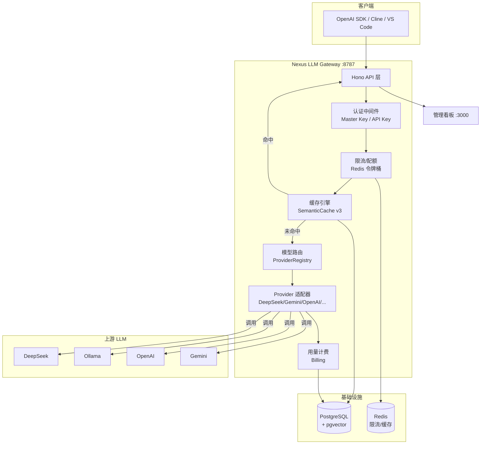
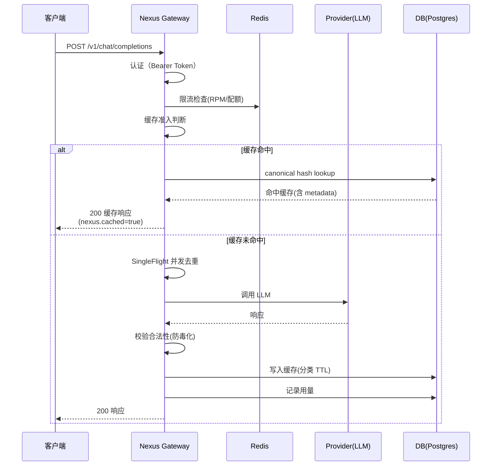

# 架构设计

## 系统架构



## 请求生命周期



## 核心模块

### 1. 认证中间件 (`middleware/auth.ts`)

- **Master Key**：管理端权限，明文对比 `.env` 中的 `GATEWAY_MASTER_KEY`
- **API Key**：租户权限，SHA-256 Hash 后与数据库对比
- 支持动态禁用 Key、记录最后使用时间

### 2. 缓存引擎 (`cache/semantic-cache.ts`)

8 大工程级特性：
1. **Canonical Key**：Prompt 标准化（trim + 空白折叠 + 标点归一）
2. **Admission Policy**：短上下文词拒绝缓存（防止误命中）
3. **SingleFlight**：并发去重（20 并发 → 1 次上游调用）
4. **参数分桶**：temperature 微小差异不破坏命中
5. **Provider/Model 隔离**：不同模型缓存互不污染
6. **分类 TTL**：常识 7 天、价格 30s、天气 10min
7. **防毒化**：error/空内容拒绝写入
8. **可观测性**：命中响应携带 cache metadata

### 3. Provider 注册中心 (`providers/registry.ts`)

- 策略模式：每种 Provider 实现 `ChatProvider` + `EmbeddingProvider` 接口
- 模型别名映射：对外别名 → 上游真实模型名
- 故障转移链：主 Provider 失败自动切换备用
- 无 Key 自动禁用：云 Provider 缺 Key 时跳过注册

### 4. 容错三件套 (`middleware/`)

| 组件 | 说明 |
|------|------|
| **CircuitBreaker** | 三态机（CLOSED/OPEN/HALF_OPEN），连续失败达阈值自动熔断 |
| **withRetry** | 指数退避重试，429/502/503 可重试，400 不重试 |
| **weightedRouter** | 按权重选择 Provider，熔断的自动跳过 |

### 5. 限流配额 (`quota/rate-limiter.ts`)

- Redis 令牌桶：按 API Key 限制每分钟请求数（默认 60 RPM）
- 月度配额：按租户限制当月 Token 总量
- 响应头 `X-RateLimit-Remaining` 返回剩余请求数

### 6. 用量计费 (`billing/usage.ts`)

- 每次请求记录：prompt_tokens / completion_tokens / cost
- 按 `modelRoutes.price` 计算费用（每百万 token 价格）
- 支持按租户/时间范围查询

## 数据模型

### tenants（租户）
```
id, name, monthly_token_quota, cache_plan, created_at
```

### api_keys（API 密钥）
```
id, tenant_id, name, key_hash, key_prefix, enabled, last_used_at
```

### semantic_cache（语义缓存）
```
id, key_hash, embedding(1536), prompt_preview, request, response, model, hits, expires_at
```

### usage_logs（用量日志）
```
id, request_id, tenant_id, provider, model, prompt_tokens, completion_tokens, cost_micro, latency_ms, cached
```

### model_routes（模型路由）
```
id, alias, provider, upstream_model, fallbacks, price_input, price_output
```

## 技术选型

| 层次 | 技术 | 理由 |
|------|------|------|
| Web 框架 | Hono | 轻量、高性能、TypeScript 原生 |
| ORM | Drizzle | 类型安全、SQL-like API |
| 数据库 | PostgreSQL + pgvector | 向量相似度搜索（缓存去重） |
| 缓存/限流 | Redis | 高性能内存存储 |
| HTTP 客户端 | undici | Node.js 原生 fetch 底层，支持 ProxyAgent |
| 日志 | Pino | 结构化 JSON 日志，低开销 |
| 看板 | Next.js + Recharts + Tailwind | 现代 UI，深色模式 |
| 测试 | Vitest | 快速、兼容 Jest API |
